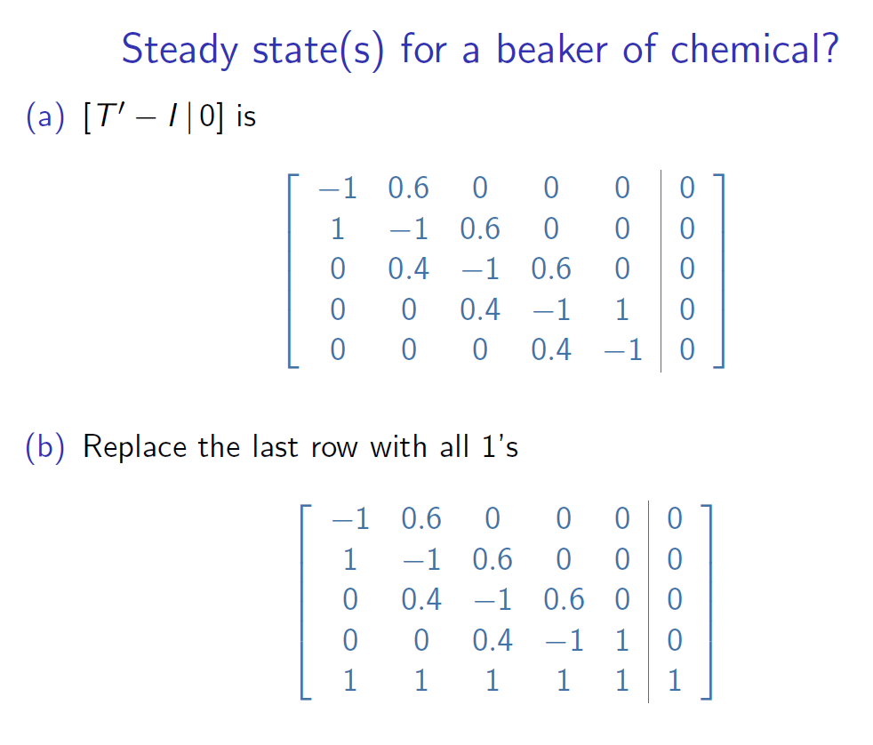

# Markov Processes
随即系统状态转移（只关心上一个状态）

## Transition Matrix
!!算的时候要转置
$x_2 = T'x_1$ 转置后的T乘上之前的状态
## State Vectors
The state vector $x_n$ shows probabilities of being in each state
after n time-steps.
## The Steady State Vector
When, as here, the columns of $(T')^n$ tend to become all the same for large values of $n$, this column $\mathbf{v}$ (in this case $\begin{pmatrix} 0.75 \\ 0.25 \end{pmatrix}$) is called a **steady state vector** because then

$(T')^n \mathbf{u} \simeq \mathbf{v}$

for any initial state vector $\mathbf{u}$.

对于Steady State Vector S：

$T'S = S$

rearrange: $T'S - S = 0$

$(T'- I )S = 0$ 这里一定要-I！！！！

There are several ways to solve the equation:
1. Gaussian (or Gauss-Jordan) elimination 行变换
- 交换两行（后面的值也要变）
- 整行乘一个系数（最后=0则不影响，不然右边的列也要乘）
- 将一行加上（或减去）另一行的倍数（同理，不是0也要对应乘）
- 某一列主对角线没有1，则这列对应的未知数可以设为t，是自由变量

2. For $2 \times 2$ systems we can use the matrix inverse formula.
- Write out the matrix equation $(T'- I )S = 0$
- Replace the second equation by $x + y = 1$
- Solve this system using matrix inverse:

3. !short-cur method
- First construct $[T'- I |0]$
- Then replace the last row with all 1's.
- Then solve by Gaussian elimination

!!!Markov process **NOT** always get to a steady state

eventual behaviour depends on where you start!!!

# Graph Theory

- An edge is **incident** on its endpoints.
- A vertex with no incident edges is **isolated**.
- A graph with no vertices (hence no edges) is **empty**.
- The **order** of a graph, G, is the number of vertices in it, i.e. $|V(G)|$  (A graph of order `0' is empty.)
## Diagrams of Graphs
## A table of edges

## Isomorphic Graphs

## Directed Graphs
- A directed graph (or digraph) is the same as a graph except that edges are **ordered** pairs of endpoints.
- Each edge has an initial vertex and a final vertex
## simple graphs
A simple graph is a graph that has **no loops (单点loop，两点来回不算) and no parallel edges**
## Complete Graphs
A complete graph on n vertices is a simple graph in which each pair of distinct vertices are adjacent (i.e. are `joined' by an edge).
A complete graph on n vertices is denoted by $K_n$.

## Bipartite Graphs

## Subgraphs
## Degree of a vertex

## Walks on Graphs
A trivial walk, say v0, contains no edges; hence has length 0.
## Konigsberg Graph
## Euler Path
an odd degree vertex **cannot** occur in the middle of a walk

## Walk
- **closed**： 起点终点一样
- **path**：does not repeat any edge 路径，不重复边
- **simple path**： does not repeat any vertex 不重复边也不重复点（除了起点终点如果连起来）
- **circuit**： closed path 回路，没重复的边
- **simple circuit**：simple closed path不重复边也不重复点的回路
## Connected Graphs
每两个点都有路径

A component of a graph is a maximal connected subgraph. 独立的连接图的数量

- **bridge**： an edge which on erasure disconnects the graph 擦了就分成两个图了
- **cut vertex**： vertex which on erasure disconnects the graph 同理

## Hamilton Paths 点亮灯，不重复点
a simple path which passes through every vertex
- 不一定用完所有的边
- 每个边最多用一次，因为path的要求
- 每个点用且用一次

年终总结：

# Trees

## Spanning trees
A spanning tree for a graph G is a subgraph of G which is a tree and contains all the vertices of G

一个图的子树，含有每个点

# Weighted Graphs

## Kruskal's algorithm for minimal spanning tree
这个是**贪心算法Greedy**

Find a globally optimal solution by finding a locally optimal solution at each step. 每步都找当前最优，来得到全局最优

这个算法永远**可以成功**，对有限图

## The Travelling salesman problem

## Shortest Path (Dijkstra's Algorithm)

  - Dijkstra's Algorithm
  - Transport networks
  - Max Flow Min Cut
  - virtual flows
  - matching problem
  - Random walks on graphs
  - Webgraphs
  - PageRank
  - damping factor
  - Iterative Approximation method
- The Halting Problem
- Modified Kruskal's Algorithm